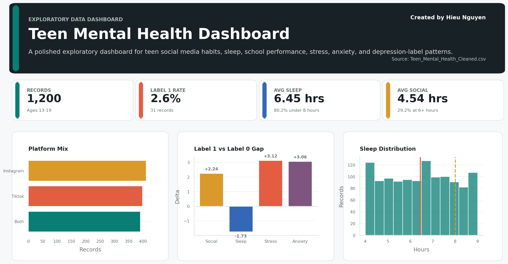

<p align="right"><strong>Created by Hieu Nguyen</strong></p>

# Teen Mental Health EDA

Exploratory data analysis project focused on teen social media behavior, sleep habits, academic performance, stress, anxiety, addiction level, and depression label indicators.

This repository contains a complete beginner-friendly data workflow:

- Load and inspect raw CSV data.
- Clean categorical text values and validate numeric ranges.
- Export a cleaned dataset.
- Build visualizations with pandas, Matplotlib, and Seaborn.
- Summarize key findings in professional project reports.

## Project Status

Status: Active learning project  
Primary dataset: `Teen_Mental_Health_Dataset.csv`  
Cleaned dataset: `Teen_Mental_Health_Cleaned.csv`  
Cleaning script: `cleaning.py`  
Main visualization notebook: `teen_visiualize.ipynb`  
Dashboard app: `dashboard.py`  
GitHub-viewable dashboard: [reports/DASHBOARD.md](reports/DASHBOARD.md)

## Repository Structure

```text
.
|-- Teen_Mental_Health_Dataset.csv
|-- Teen_Mental_Health_Cleaned.csv
|-- reports/
|   |-- DATA_CLEANING_REPORT.md
|   |-- DATA_DICTIONARY.md
|   |-- DASHBOARD.md
|   |-- EDA_REPORT.md
|   |-- figures/
|   |-- SOW.md
|   `-- VISUALIZATION_REPORT.md
|-- cleaning.py
|-- dashboard.py
|-- generate_static_dashboard.py
|-- teen_visiualize.ipynb
|-- requirements.txt
`-- README.md
```

## Business Question

How do teen lifestyle and digital behavior variables relate to sleep, academic performance, stress, anxiety, addiction level, and depression label outcomes?

This project is descriptive EDA. It identifies patterns and relationships in the dataset, but it does not prove causation and should not be used as medical advice.

## Dataset Overview

The cleaned teen dataset contains:

- Rows: 1,200
- Columns: 13
- Missing values after cleaning: 0
- Duplicate rows after cleaning: 0
- Age range: 13 to 19

Key columns include:

- `age`
- `gender`
- `daily_social_media_hours`
- `platform_usage`
- `sleep_hours`
- `screen_time_before_sleep`
- `academic_performance`
- `physical_activity`
- `social_interaction_level`
- `stress_level`
- `anxiety_level`
- `addiction_level`
- `depression_label`

See [reports/DATA_DICTIONARY.md](reports/DATA_DICTIONARY.md) for the full data dictionary.

## Key Findings

- The dataset contains 1,200 teen records with no missing values or duplicate rows after cleaning.
- Average age is approximately 15.93 years.
- Average daily social media use is approximately 4.54 hours.
- Average sleep is approximately 6.45 hours.
- About 80.17% of records show sleep below 8 hours.
- Depression label distribution is highly imbalanced: 31 records are labeled `1`, representing 2.58% of the dataset.
- Teens with depression label `1` show lower average sleep hours than label `0`.
- Teens with depression label `1` show higher average daily social media hours than label `0`.
- Academic performance above 3.5 appears in 285 records, or 23.75% of the dataset.

Detailed interpretation is available in [reports/EDA_REPORT.md](reports/EDA_REPORT.md).

## GitHub Dashboard Preview

Open the full static dashboard here:

[View Dashboard On GitHub](reports/DASHBOARD.md)



## Reports

- [Statement of Work](reports/SOW.md)
- [Data Dictionary](reports/DATA_DICTIONARY.md)
- [GitHub Dashboard](reports/DASHBOARD.md)
- [Data Cleaning Report](reports/DATA_CLEANING_REPORT.md)
- [EDA Report](reports/EDA_REPORT.md)
- [Visualization Report](reports/VISUALIZATION_REPORT.md)

## Environment Setup

Create and activate a virtual environment:

```powershell
python -m venv .venv2
.\.venv2\Scripts\activate
```

Install dependencies:

```powershell
python -m pip install -r requirements.txt
```

Start Jupyter:

```powershell
jupyter notebook
```

Open the visualization notebook:

1. `teen_visiualize.ipynb`

## Dashboard

View the static dashboard directly on GitHub:

- [GitHub-viewable dashboard](reports/DASHBOARD.md)

Run the Streamlit dashboard:

```powershell
streamlit run dashboard.py
```

Regenerate the GitHub dashboard charts:

```powershell
python generate_static_dashboard.py
```

The dashboard includes:

- Sidebar filters for age, gender, platform, social interaction level, and depression label.
- KPI cards for record count, label 1 rate, average sleep, average social media use, and sleep below 8 hours.
- Overview, lifestyle signal, label comparison, and data table tabs.
- A filtered CSV download button.

## Common Commands

Load the cleaned dataset:

```python
import pandas as pd

df = pd.read_csv("Teen_Mental_Health_Cleaned.csv")
df.head()
```

Check missing values:

```python
df.isnull().sum()
```

Check duplicate rows:

```python
df.duplicated().sum()
```

Export a cleaned CSV:

```python
df.to_csv("Teen_Mental_Health_Cleaned.csv", index=False)
```

## Important Notes

- This project is for data analysis and learning purposes.
- The `depression_label` column is treated as a dataset label, not a clinical diagnosis.
- Correlation and group averages should be interpreted carefully.
- Findings should not be used to make medical, educational, or policy decisions without additional validation.
