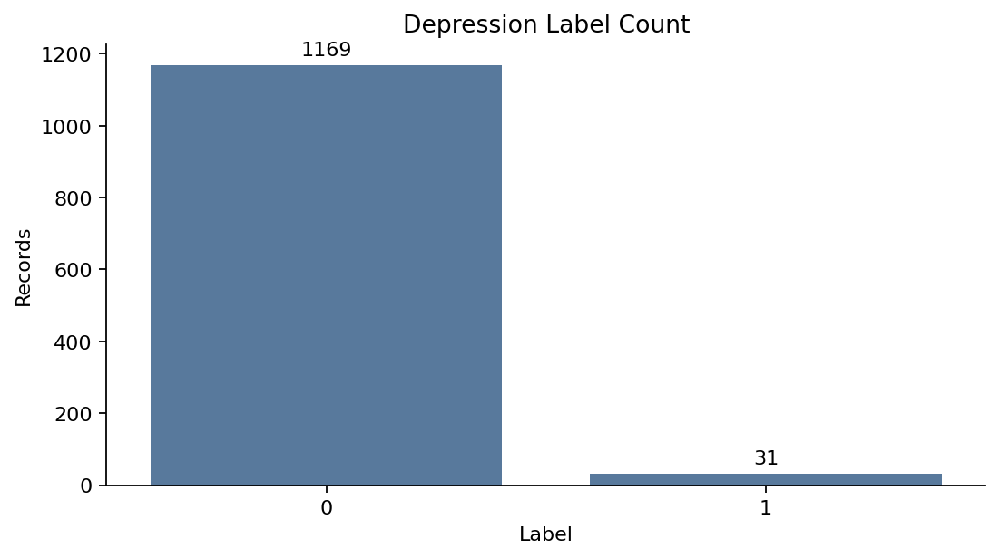
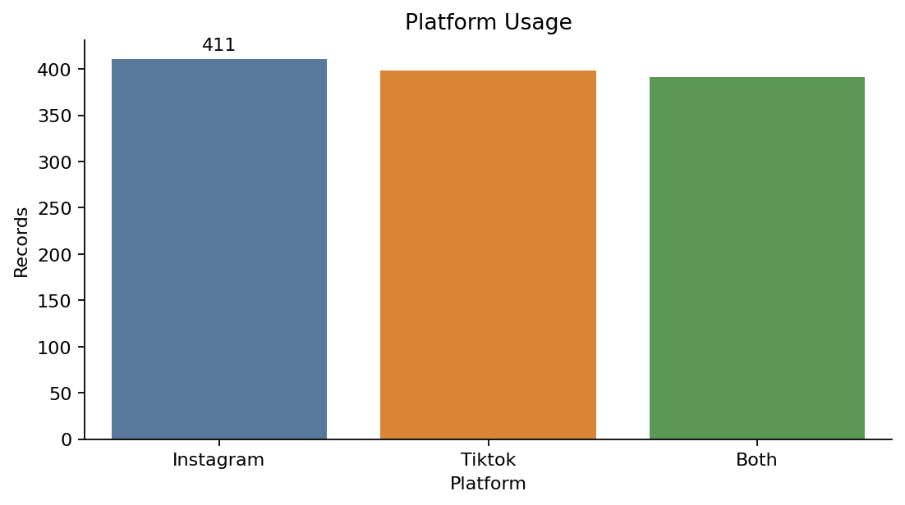
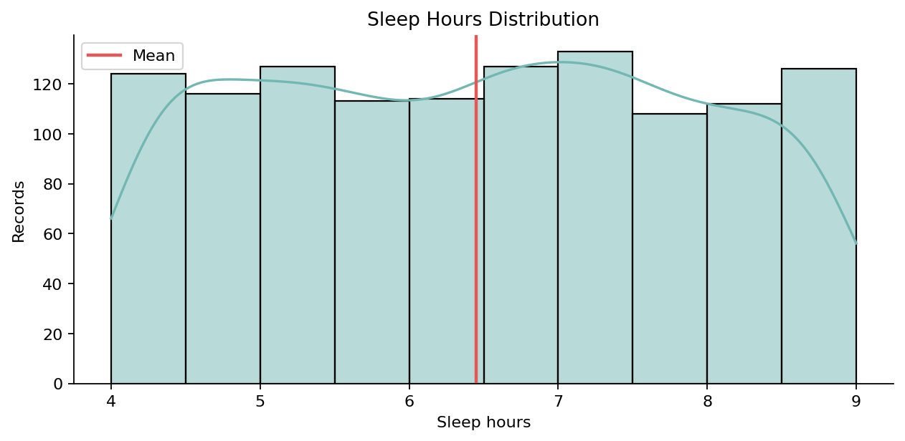
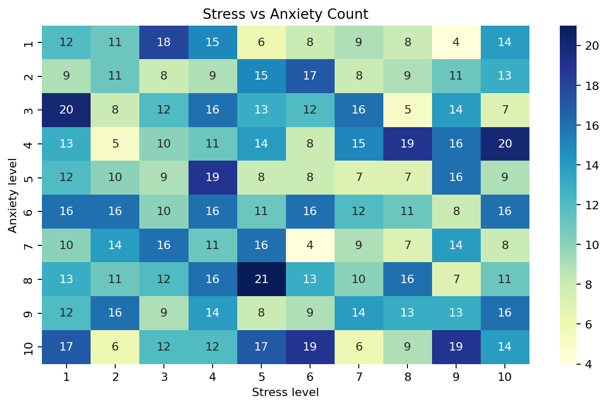
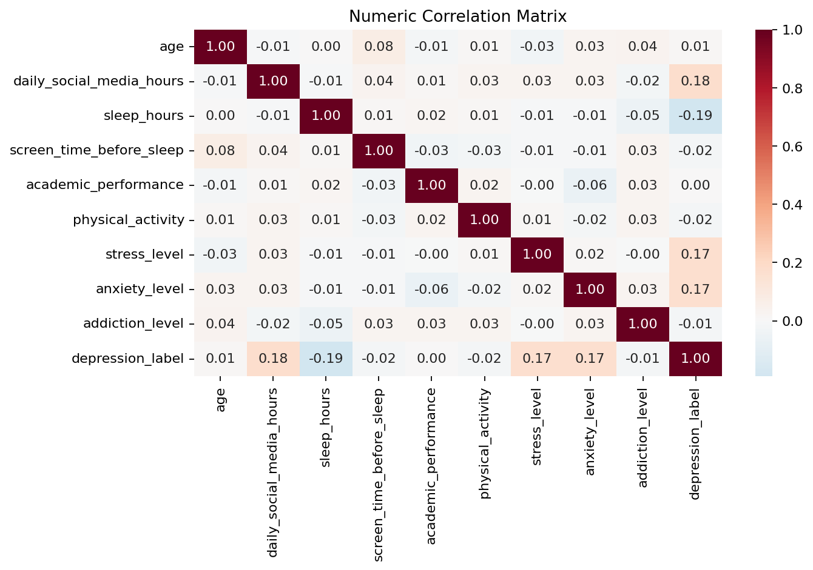
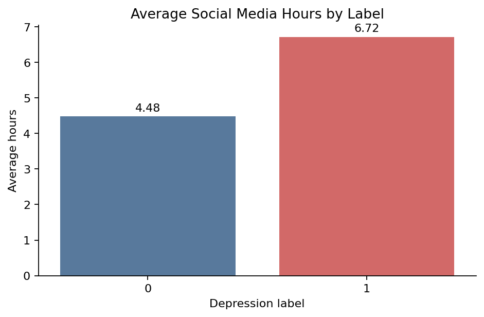
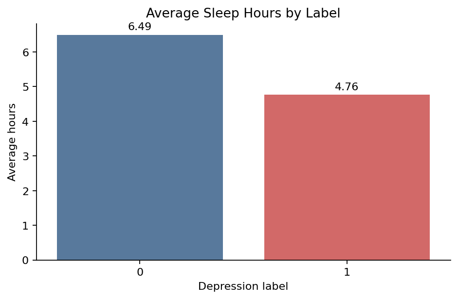
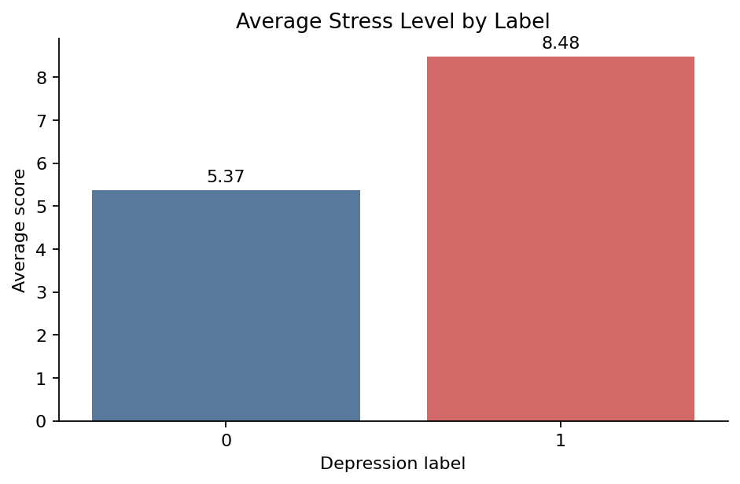
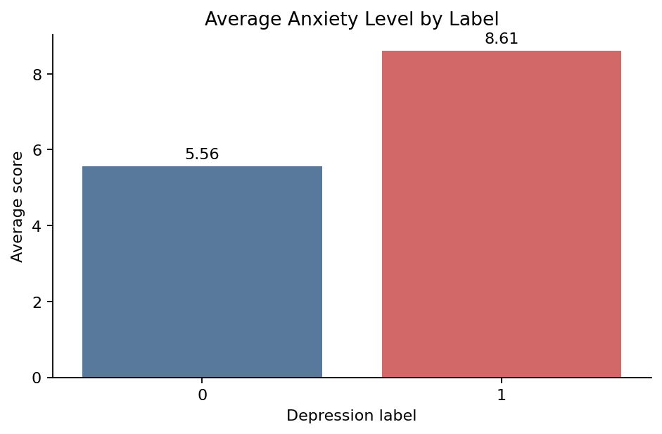

# Teen Mental Health Dashboard

This is a GitHub-friendly static dashboard generated from `Teen_Mental_Health_Cleaned.csv`. GitHub cannot run Streamlit apps inside the repository file view, so this page saves the dashboard charts as PNG images that can be viewed directly on GitHub.

## KPI Summary

| Metric | Value |
|---|---:|
| Records | 1,200 |
| Columns | 13 |
| Average daily social media hours | 4.54 |
| Average sleep hours | 6.45 |
| Sleep under 8 hours | 80.17% |
| Depression label 1 records | 31 |
| Depression label 1 rate | 2.58% |
| Academic performance above 3.5 | 285 (23.75%) |

## Label Comparison

| Depression label | Records | Avg social media hours | Avg sleep hours | Avg stress | Avg anxiety |
|---:|---:|---:|---:|---:|---:|
| 0 | 1,169 | 4.48 | 6.49 | 5.37 | 5.56 |
| 1 | 31 | 6.72 | 4.76 | 8.48 | 8.61 |

## Overview Charts

## Lifestyle Signals

## Depression Label Differences

## Notes

- This dashboard is descriptive exploratory analysis only.
- The `depression_label` column is a dataset label, not a clinical diagnosis.
- The label 1 group is small, so comparisons should be interpreted carefully.
- Run the interactive version locally with `streamlit run dashboard.py`.
