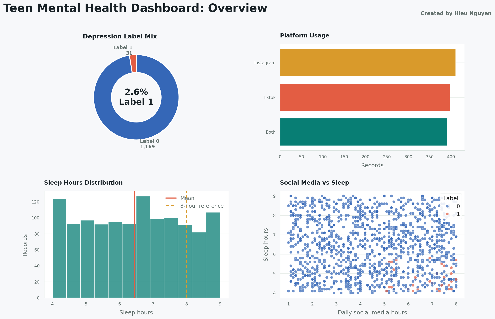
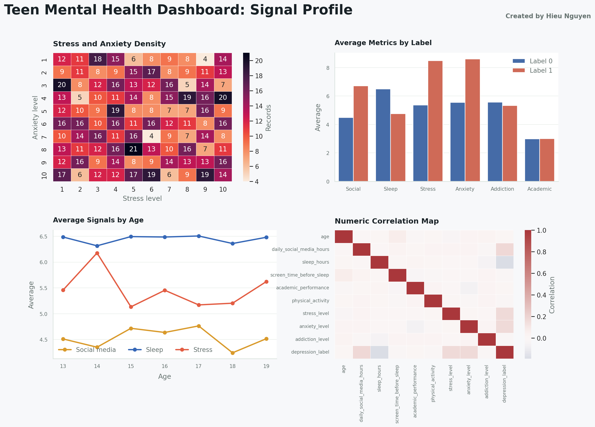

<strong>Created by Hieu Nguyen</strong>

# Teen Mental Health Dashboard

## Executive Snapshot

| Metric | Value |
|---|---:|
| Records | 1,200 |
| Columns | 13 |
| Average daily social media hours | 4.54 |
| Average sleep hours | 6.45 |
| Sleep under 8 hours | 80.17% |
| 6+ daily social media hours | 351 (29.25%) |
| Depression label 1 records | 31 |
| Depression label 1 rate | 2.58% |

## Label 1 vs Label 0

| Comparison | Difference |
|---|---:|
| Daily social media hours | +2.24 |
| Sleep hours | -1.73 |
| Stress level | +3.12 |
| Anxiety level | +3.06 |

## Visual Dashboard Boards

## Label Comparison Table

| Depression label | Records | Avg social media hours | Avg sleep hours | Avg stress | Avg anxiety |
|---:|---:|---:|---:|---:|---:|
| 0 | 1,169 | 4.48 | 6.49 | 5.37 | 5.56 |
| 1 | 31 | 6.72 | 4.76 | 8.48 | 8.61 |

## Notes

- Generated from `Teen_Mental_Health_Cleaned.csv`.
- This dashboard is descriptive exploratory analysis only.
- The `depression_label` column is a dataset label, not a clinical diagnosis.
- Run the interactive version locally with `streamlit run dashboard.py`.
